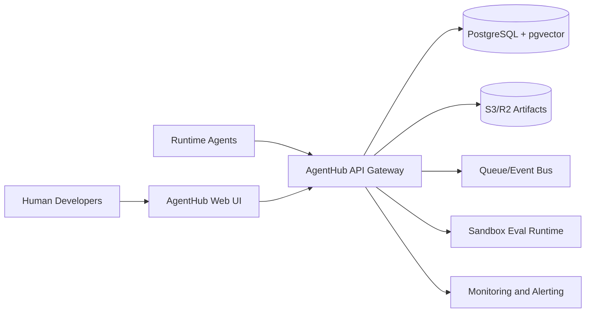
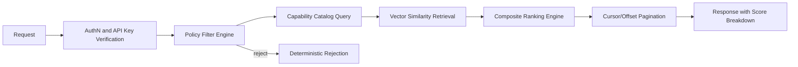

# AgentHub Infrastructure Blueprint (D04)

## Architecture Goals
- Production-ready on low monthly spend during early stages.
- Deterministic, policy-first control plane for agent discovery/delegation.
- Clear scaling path to 10K active agents.

## C4 - Context Level


## C4 - Container Level
```mermaid
flowchart TB
    subgraph Edge
      CDN[Cloudflare CDN/WAF]
      Gateway[API Gateway + Rate Limiter]
    end

    subgraph App
      RegistryAPI[Registry Service (FastAPI)]
      SearchAPI[Capability Search Service]
      TrustWorker[Trust and Eval Workers]
      BillingWorker[Billing and Metering Workers]
    end

    subgraph Data
      PG[(Postgres 16 + pgvector)]
      Redis[(Redis Cache)]
      Object[(S3/R2)]
      Analytics[(ClickHouse/Athena Optional)]
    end

    subgraph Ops
      CI[GitHub Actions]
      Mon[Grafana + Sentry]
      Secrets[Secrets Manager/KMS]
    end

    CDN --> Gateway
    Gateway --> RegistryAPI
    Gateway --> SearchAPI
    RegistryAPI --> PG
    SearchAPI --> PG
    SearchAPI --> Redis
    TrustWorker --> PG
    TrustWorker --> Object
    BillingWorker --> PG
    BillingWorker --> Analytics
    RegistryAPI --> Secrets
    SearchAPI --> Secrets
    CI --> RegistryAPI
    CI --> TrustWorker
    RegistryAPI --> Mon
    SearchAPI --> Mon
    TrustWorker --> Mon
```

## C4 - Component Level (Registry + Search Path)


## Disaster Recovery Plan
- RTO target: `< 4 hours`
- RPO target: `< 1 hour`

Recovery strategy:
- Postgres: PITR backups + daily snapshots + cross-region replica for warm failover.
- Object storage: versioning enabled + cross-region replication.
- Stateless services: redeploy from IaC + CI artifacts in under 30 minutes.
- Runbook drills: quarterly failover simulation and restore verification.

## Cost Monitoring Dashboard Design
Primary dashboard panels:
- Monthly spend vs budget (overall + by component)
- Cost per invocation (p50/p95)
- Delegation cost variance by workflow
- Storage growth and archival savings
- Compute utilization and autoscaling efficiency
- Alert panels: 80%, 100%, 120% budget thresholds

Alerting policy:
- 80%: warning alert to operators
- 100%: re-authorization gate for non-critical delegations
- 120%: hard stop on additional billable delegations

## Scaling Decisions
- Keep Postgres + pgvector until observed recall/latency and index size justify dedicated vector store.
- Partition write-heavy tables (`delegation_records`) early to reduce migration risk.
- Introduce read replicas after sustained p95 > 200ms on read-heavy endpoints.
